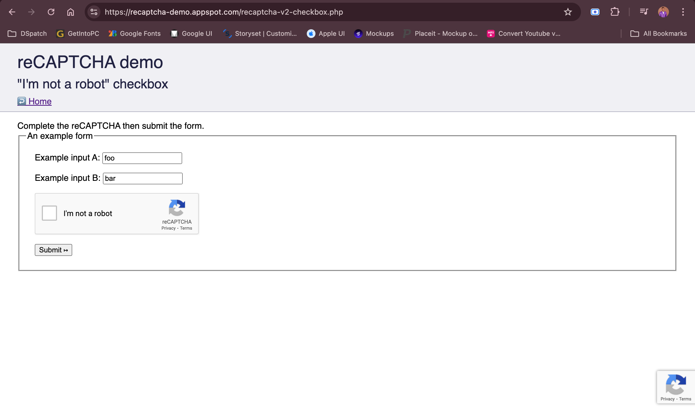
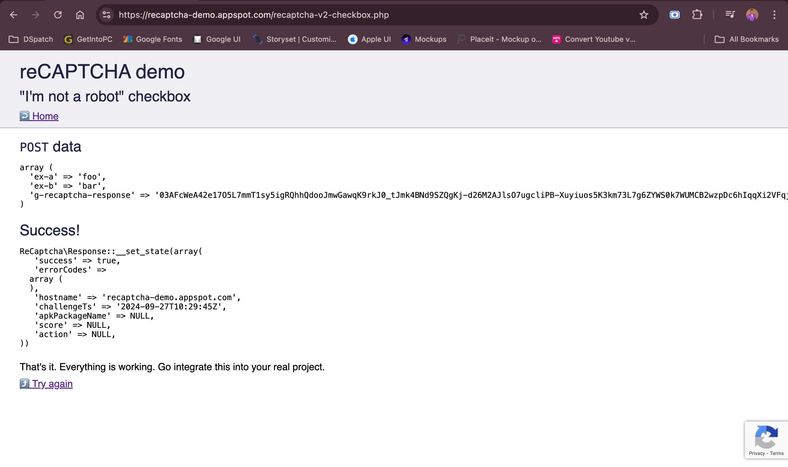
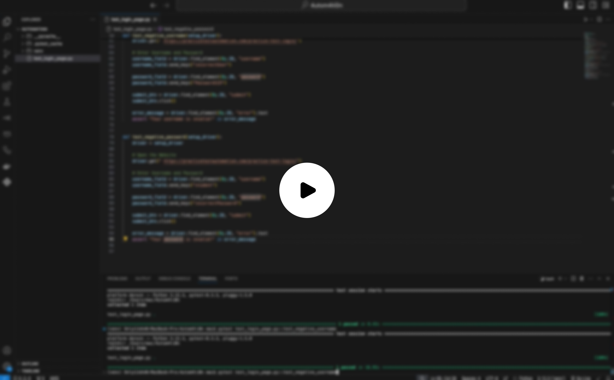

# Handling Captchas in Automation Manually

This project demonstrates how to handle captchas manually during automated browser testing using Selenium and pytest. While automation frameworks can handle various aspects of web testing, captchas are designed to block automation bots. This guide shows how to pause the script and allow manual input for captcha solving, then resume automated testing.

Website : (https://recaptcha-demo.appspot.com/recaptcha-v2-checkbox.php)

## Table of Contents

1. [Introduction](#introduction)
2. [Prerequisites](#prerequisites)
3. [Installation](#installation)
4. [How It Works](#how-it-works)
5. [Usage](#usage)
6. [Project Structure](#project-structure)
7. [Sample Test Flow](#sample-test-flow)
8. [Future Improvements](#future-improvements)

---

## Introduction

Automating tests that involve captchas can be challenging since captchas are meant to distinguish humans from bots. While there are tools like 2captcha for automated captcha solving, this project focuses on a manual approach to handle captchas in an otherwise automated test suite.



[](https://youtu.be/10X5B2aSK9Y?si=Slc58HEc37Np2eSq)

## Prerequisites

Before running this project, ensure you have the following installed:

1. **Python 3.7+**: You can download it from [python.org](https://www.python.org/downloads/).
2. **Google Chrome**: Make sure you have the latest version installed from [here](https://www.google.com/chrome/).
3. **ChromeDriver**: Download the matching version for your Chrome from [ChromeDriver](https://sites.google.com/chromium.org/driver/) and add it to your system's PATH.
4. **Selenium**: WebDriver for controlling browsers.
5. **Pytest**: Testing framework for Python.

## Installation

1. Clone the repository:

    ```bash
    git clone https://github.com/Only1JohnN/handling-captchas-in-automation-manually.git
    ```

2. Install the dependencies:

    ```bash
    pip install -r requirements.txt
    ```

3. Verify that **ChromeDriver** is set up correctly by running:

    ```bash
    chromedriver --version
    ```

## How It Works

This script automates the following steps:

- Clear and fill input fields (pre-populated with "foo" and "bar") with new values ("Adeniyi" and "John").
- Wait for you to manually solve the captcha and prompt you to press "Enter" to resume the script.
- Automatically submit the form after captcha verification.
- Assert that the captcha was solved correctly by checking the page URL for success conditions.

The script uses **pytest** with the `-s` flag, allowing interaction with the terminal to pause the script for manual captcha solving.

## Usage

1. To run the test script, use the following command:

    ```bash
    pytest -s
    ```

   The `-s` option allows interaction with the console, pausing for you to manually solve the captcha.

2. After the script runs, it will:

    - Navigate to the [captcha demo page](https://recaptcha-demo.appspot.com/recaptcha-v2-checkbox.php).
    - Clear the input fields and fill them with new values.
    - Pause and wait for you to solve the captcha.
    - Automatically submit the form after captcha verification.

## Project Structure

```
handling-captchas-in-automation/
│
├── tests/                        # Contains the test cases
│   └── test_file.py              # Test script with manual captcha handling
│
├── requirements.txt              # List of project dependencies
└── README.md                     # This documentation
```

## Sample Test Flow

Here’s a summary of the flow in the test:

1. **Open Browser**: The browser is launched and navigates to the captcha demo site.
2. **Clear Fields**: Pre-populated fields "foo" and "bar" are cleared and filled with "Adeniyi" and "John."
3. **Pause for Captcha**: The script pauses, asking you to solve the captcha manually and press "Enter" when done.
4. **Submit Form**: After captcha solving, the form is submitted automatically.
5. **Validation**: The test validates whether the captcha was solved successfully based on the redirected URL.

## Future Improvements

- **Automated Captcha Solving**: Integration with 2captcha or similar services for solving captchas automatically.
- **Dynamic Browser Support**: Extend the script to handle cross-browser testing (e.g., Firefox, Edge).
- **Improved Logging**: Add more detailed logging for debugging and tracking the test flow.